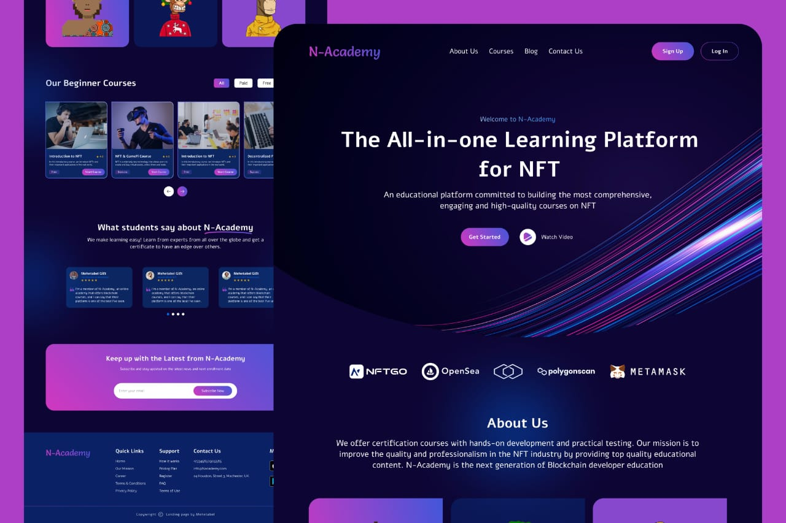

# MY PORTFOLIO WEBSITE

## About The Project 

This is an NFT academy web application. An NFT Academy site where users can sign up to get courses and materials to learn about web3 development. It was built to improve on my React, React Slick

## Frontend Interface of my N-Academy Web Application
 

## Technologies Used

- React.js
- React Slick to create the sliding carousel
- Tailwind CSS and CSS for styling
- React-icons for the icons

## Navigation 🔍

- About
- Courses
- Blog
- Contact

## App Links 

Production Website Link: ()

Project Github Repo Link: ()
